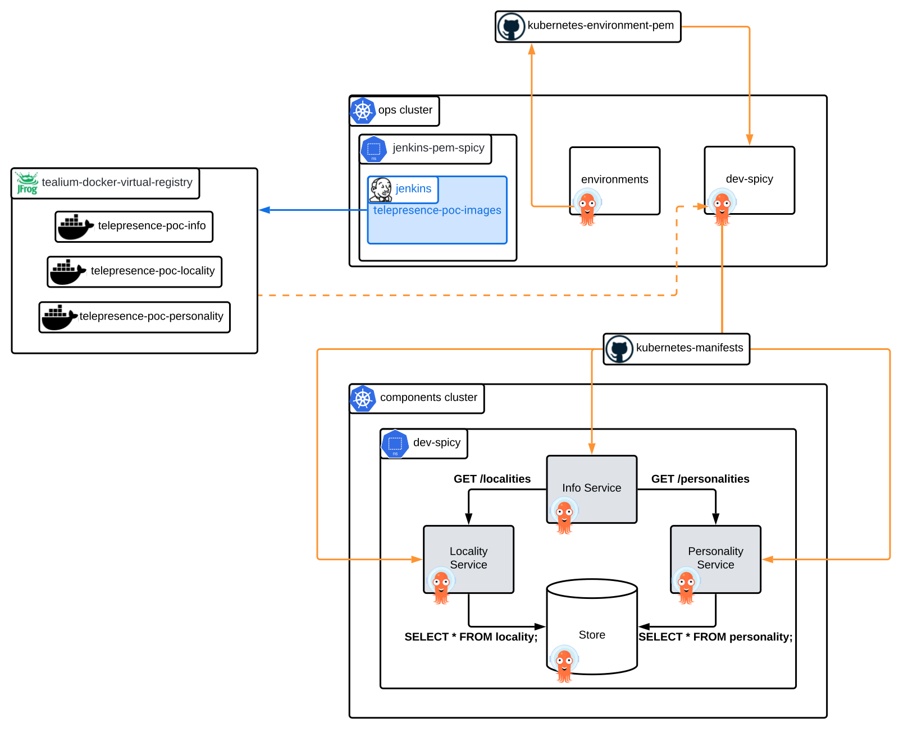
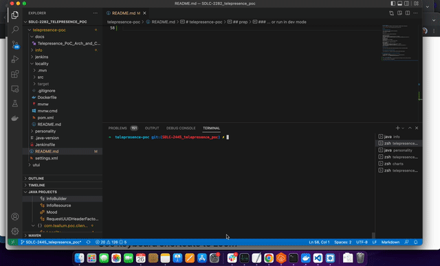

# telepresence-poc
This is a sample app intended to serve the purpose of demonstrating Telepresence.



## prep

### install prerequisites
```
% arch -arm64 brew install quarkusio/tap/quarkus
% brew install corretto11
```
version info:
```
% brew info corretto11 quarkusio/tap/quarkus

corretto11: 11.0.15.9.1
https://corretto.aws/
/opt/homebrew/Caskroom/corretto11/11.0.15.9.1 (176.9MB)
From: https://github.com/Homebrew/homebrew-cask-versions/blob/HEAD/Casks/corretto11.rb
==> Name
AWS Corretto JDK
==> Description
OpenJDK distribution from Amazon
==> Artifacts
amazon-corretto-11.0.15.9.1-macosx-x64.pkg (Pkg)

quarkusio/tap/quarkus: stable 2.10.2.Final
CLI for Quarkus
https://quarkus.io
/opt/homebrew/Cellar/quarkus/2.10.2.Final (8 files, 22.2MB) *
  Built from source on 2022-07-11 at 09:11:40
From: https://github.com/quarkusio/homebrew-tap/blob/HEAD/Formula/quarkus.rb
License: Apache-2.0
```
### clue in jenv
```
% jenv add /Library/Java/JavaVirtualMachines/amazon-corretto-11.jdk/Contents/Home
```

### learning about quarkus-maven-plugin
```
% mvn help:describe -e -Dplugin=io.quarkus.platform:quarkus-maven-plugin
```

###  package, build, and run an initial container image...
```
% ./mvnw package -Pnative
$ docker build -f src/main/docker/Dockerfile.jvm -t quarkus/personality .
% docker run -i --rm -p 8080:8080 quarkus/personality
```

### ... or run in dev mode
> i.e. to run locality locally in dev mode execute the following from the locality directory.
```
./mvnw compile quarkus:dev -Ddebug=$DEBUG_PORT
```


Repeat this :point_up: for the info and personality services if desired.